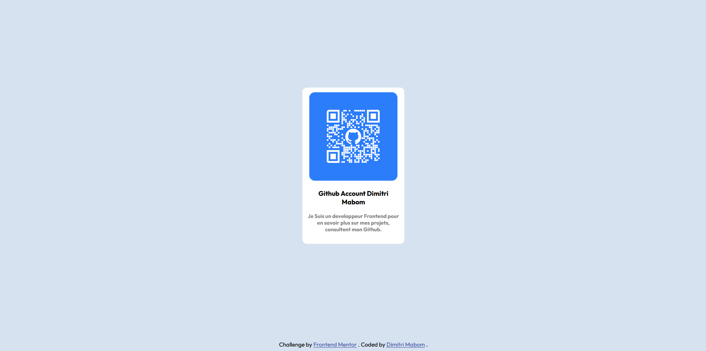

# Frontend Mentor - QR code component solution

This is a solution to the [QR code component challenge on Frontend Mentor](https://www.frontendmentor.io/challenges/qr-code-component-iux_sIO_H). Frontend Mentor challenges help you improve your coding skills by building realistic projects.

## Table of contents

- [Overview](#overview)
  - [Screenshot](#screenshot)
  - [Links](#links)
- [My process](#my-process)
  - [Built with](#built-with)
  - [What I learned](#what-i-learned)
  - [Useful resources](#useful-resources)
- [Author](#author)

## Overview

### Screenshot



### Links

- Solution URL: [https://github.com/dimysenpai/qr-code-component](https://github.com/dimysenpai/qr-code-component)
- Live Site URL: [https://qr-code-component-z02j.onrender.com](https://qr-code-component-z02j.onrender.com)

## My process

### Built with

- Semantic HTML5 markup
- CSS custom properties
- Flexbox

### What I learned

I remembered some forgotten CSS attributes, such as flex-grow which has an element in a flex box take up all the remaining space.

```css
.content {
  flex-grow: 1;
}
```

### Useful resources

- [Free Host](https://render.com/) - Our fastest path to production
Build, deploy, and scale your apps with unparalleled ease – from your first user to your billionth.
- [Generate my QR Code](https://myqrcode.com/) - This site allowed me to easily generate my QR Code.
- [Font Used](https://fonts.google.com/specimen/Outfit) - This font is really very beautiful

## Author

- Website - [Dimitri Mabom](https://github.com/dimysenpai)
- Frontend Mentor - [@dimysenpai](https://www.frontendmentor.io/profile/dimysenpai)
- Linkedin - [Dimitri Mabom](https://www.linkedin.com/in/dimitri-mabom/)
